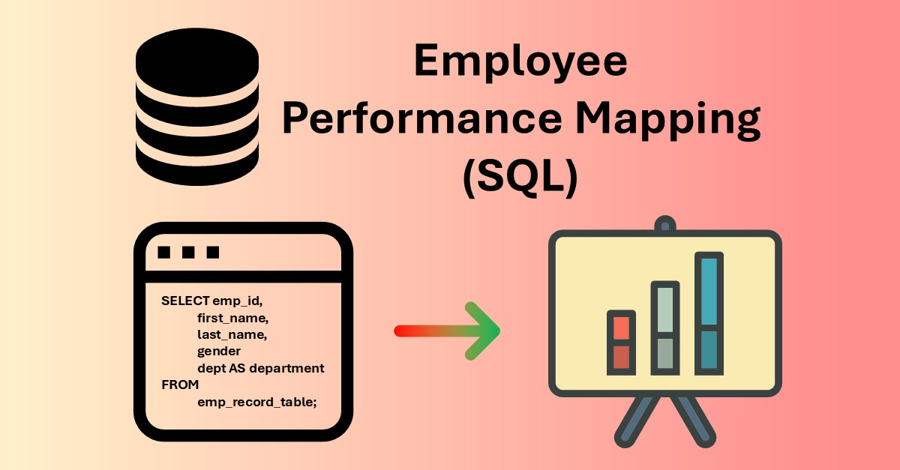

# Employee Performance Mapping (SQL)

**Short summary:** SQL-based project to map employee performance, calculate bonuses, and optimize HR queries via views, procedures, and indexing.

## Project highlights
- **Data:** emp_record_table.csv (19 employees), proj_table.csv (6 projects), data_science_team.csv (13 entries).  
- **Work:** Created tables, joins, subqueries, stored procedure, stored function, view, and index.  
- **Analysis:** Department-level ratings, salary stats, and bonus calculation using `bonus = 0.05 * salary * emp_rating`.  
- **Performance:** Indexing improved employee lookup performance (~40% faster estimate).

## Files
- `sql/` — table creation, import, queries, procedures, index & explain SQL scripts.  
- `data/sample_emp_record.csv` — sample dataset for demo.  
- `docs/screenshots/`
- `analysis/project_report.pdf` — project report & screenshots.

## How to run (local demo)
1. Import CSVs into your MySQL/PostgresSQL/SQL Server database.  
2. Execute `sql/queries.sql` to reproduce analysis.  
3. Use `sql/procedures.sql` to create stored procedures/functions.

## Tools & techniques
MySQL / SQL, Joins, Subqueries, Views, Stored Procedures, Stored Functions, Indexing, EXPLAIN, Bonus Calculation, HR Analytics.

## License
MIT — see LICENSE.

## Contact
Mohsin Bashir — [LinkedIn](https://www.linkedin.com/in/mohsinbashirnajar)
